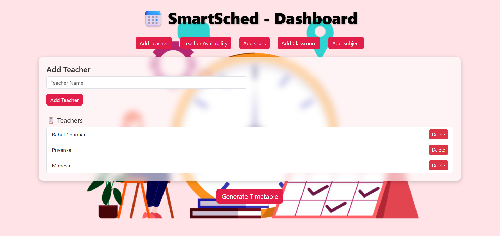
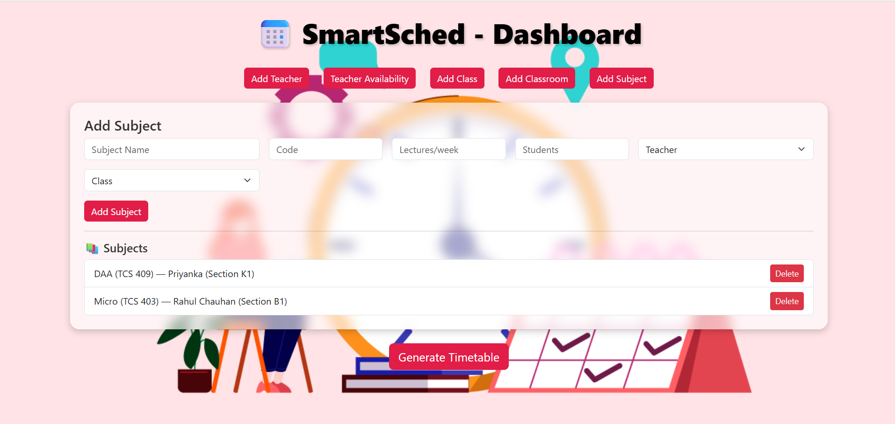
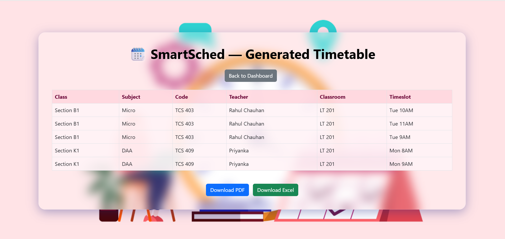

# 📅 SmartSched — AI-Powered Timetable Generator


SmartSched is an intelligent, conflict-free timetable generator for schools, colleges, or institutions.  
It automates timetable scheduling using **Graph Coloring** and **Backtracking algorithms**, minimizing human effort and errors.

---

## 🚀 Features

- ✅ Conflict-free timetable generation
- ✅ Graph Coloring and Backtracking algorithm implementation
- ✅ Simple Python codebase — easy to understand and extend
- ✅ HTML interface for easy input and output
- ✅ Lightweight and adaptable to any institution

---

## 📸 Screenshots





---

## 🛠️ Tech Stack

- **Python 3.x**
- **HTML/CSS**
- **SQLite** (optional)

---

## 📂 Project Structure

```

SmartSched/
├── app.py               # Main app logic
├── backtracking.py      # Backtracking algorithm
├── graph\_coloring.py    # Graph Coloring logic
├── index.html           # Frontend page
├── timetable.html       # Output timetable page
├── requirements.txt     # Dependencies
├── README.md            # Project documentation

````

---

## ⚙️ Setup & Run

1️⃣ **Clone this repo**
```bash
git clone https://github.com/deepalichauhan16/SmartSched-.git
cd SmartSched-
````

2️⃣ **Install dependencies**

```bash
pip install -r requirements.txt
```

3️⃣ **Run the app**

```bash
python app.py
```

4️⃣ **View timetable**
Open `index.html` in your browser to input data and generate the timetable.

---

## ⚡ How it Works

* **Graph Coloring:** Ensures no overlapping classes/teachers/rooms.
* **Backtracking:** Finds feasible combinations for complex constraints.

The system guarantees a practical timetable that avoids scheduling conflicts.

---

## 📌 Future Scope

* Add user authentication (teachers, admins)
* Export as PDF/Excel
* Add more input validation and customization
* Build a full web dashboard (Flask, Django)

---

## 🤝 Contributing

Contributions are welcome! Please fork this repository and submit a pull request.

---

## 📜 License

This project is licensed under the [MIT License](LICENSE).

---

## ✨ Author

**Deepali Chauhan**
🔗 [LinkedIn](https://www.linkedin.com/in/deepali-chauhan-b7881230b?utm_source=share&utm_campaign=share_via&utm_content=profile&utm_medium=android_app)
📫 \[[your-email@example.com](mailto:deepalic1612@gmail.com)]

---


